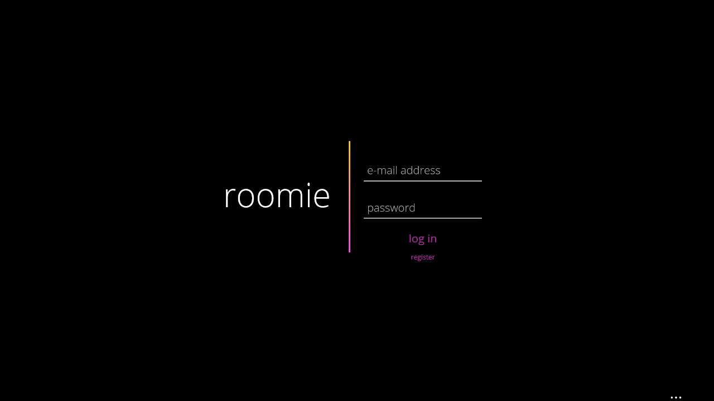
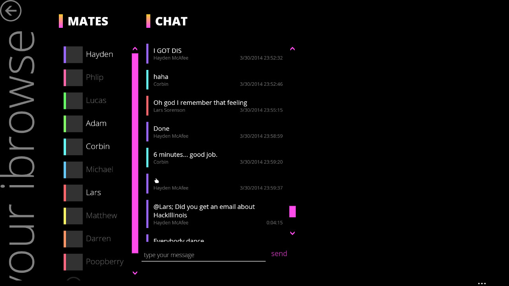

# Roomie

Roomie was a web-app I built in college that was meant to help roommates
communicate and manage things like expenses, groceries, etc.

I never wound up finishing it, but I learned a lot about making more polished
single page-web apps and using websockets for real-time communication.

